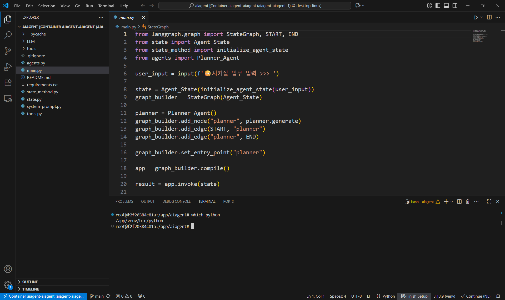

# 설치법
- 리눅스
```shell
> cd ~
> docker compose up
```

- 윈도우
```
> dir ~
> docker compose up
```

# 삭제법
```shell
> docker compose down
> docker rmi aiagent-aiagent:latest
```

# 용도 : aiagent 개발 가상 서버
- os 버전 : Debian GNU/Linux 13 (trixie)
- python 버전 : Python 3.13.9
- 작업 경로 : /app/aiagent
- 별도 필요 파일 : .env([구글 api 문서](https://aistudio.google.com/api-keys))
```
GOOGLE_API_KEY="~"
```

