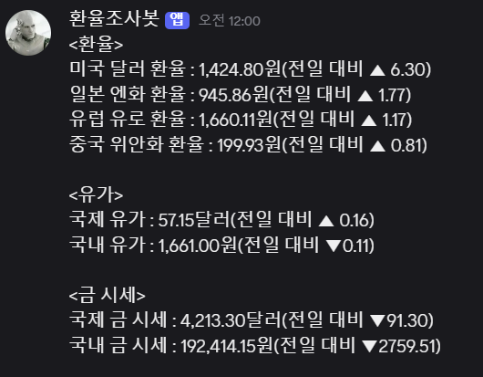

# 설치법
- 리눅스
```shell
> cd ~
> docker compose up
```

- 윈도우
```
> dir ~
> docker compose up
```

# 삭제법
```shell
> docker compose down
> docker rmi exchange_search-bot:latest
```

# 용도 : 환율 관련 조사봇
- os 버전 : Debian GNU/Linux 13 (trixie)
- python 버전 : Python 3.13.9
- 작업 경로 : /app/Exchange_Rate_Search_Bot
- 별도 필요 파일 : .env
```
WEBHOOK_URL="~"
INDEX_URL="https://finance.naver.com/marketindex"
CURRUNCY="exchangeList"
JAP="jpy"
USA="usd"
EU="eur"
CN="cny"
OILGOLD="oilGoldList"
WOIL="wti"
KOIL="gasoline"
WGOLD="gold_inter"
KGOLD="gold_domestic"
NUM="value"
CHANGE="change"
UPDOWN="blind"
```

