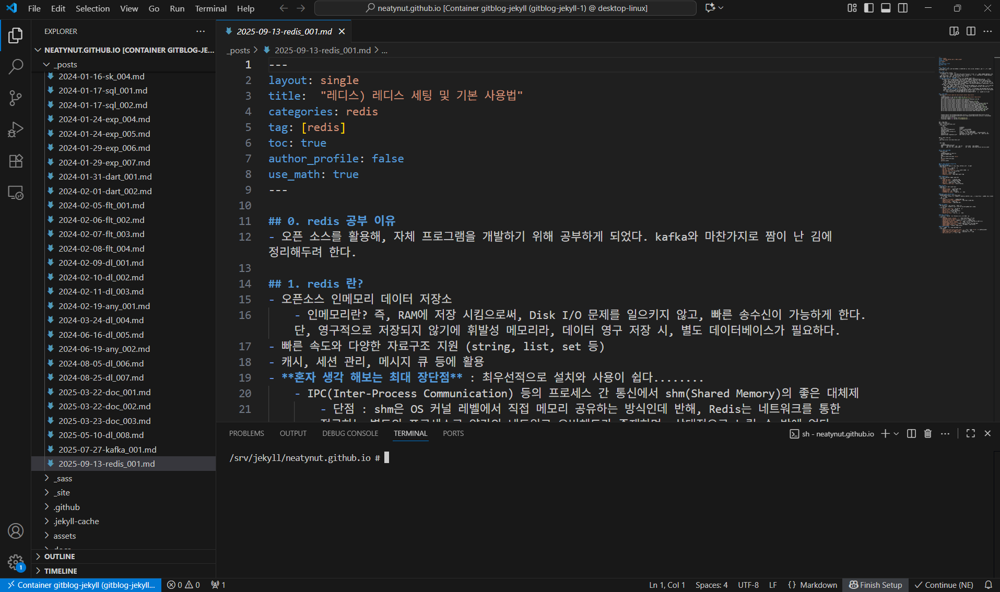

# 설치법
- 리눅스
```shell
> cd ~
> docker compose up
```

- 윈도우
```
> dir ~
> docker compose up
```

# 삭제법
```shell
> docker compose down
> docker rmi gitblog-jekyll:latest
```

# 용도 : gitblog 개발 가상 서버
- os 버전 : Alpine Linux v3.22
- Ruby 버전 : ruby 3.3.9
- 작업 경로 : /srv/jekyll/
- 블로그 빌드 주소 : http://127.0.0.1:4000/

